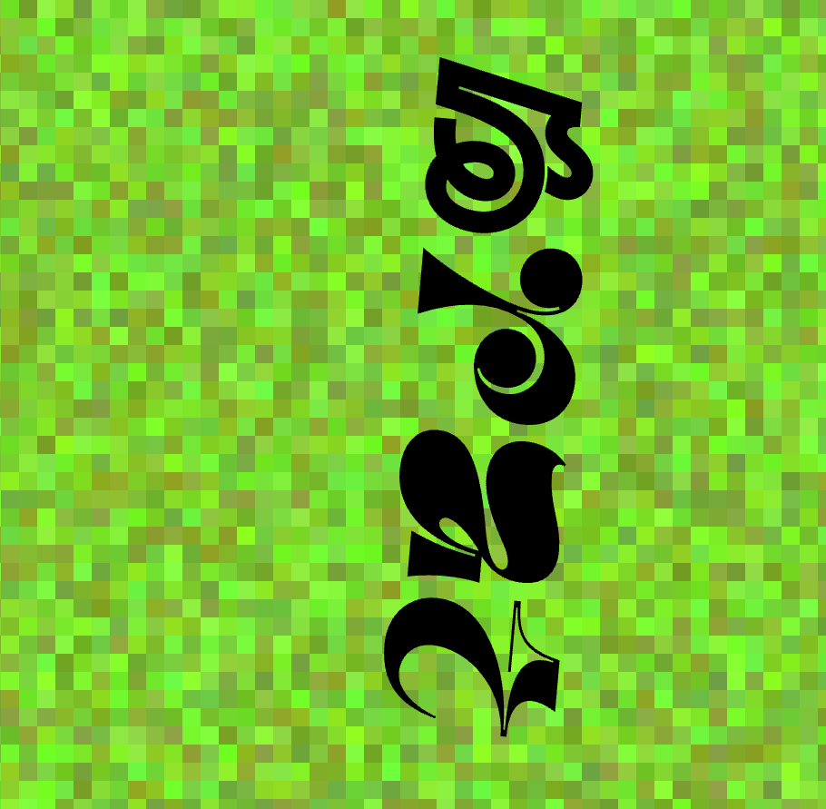
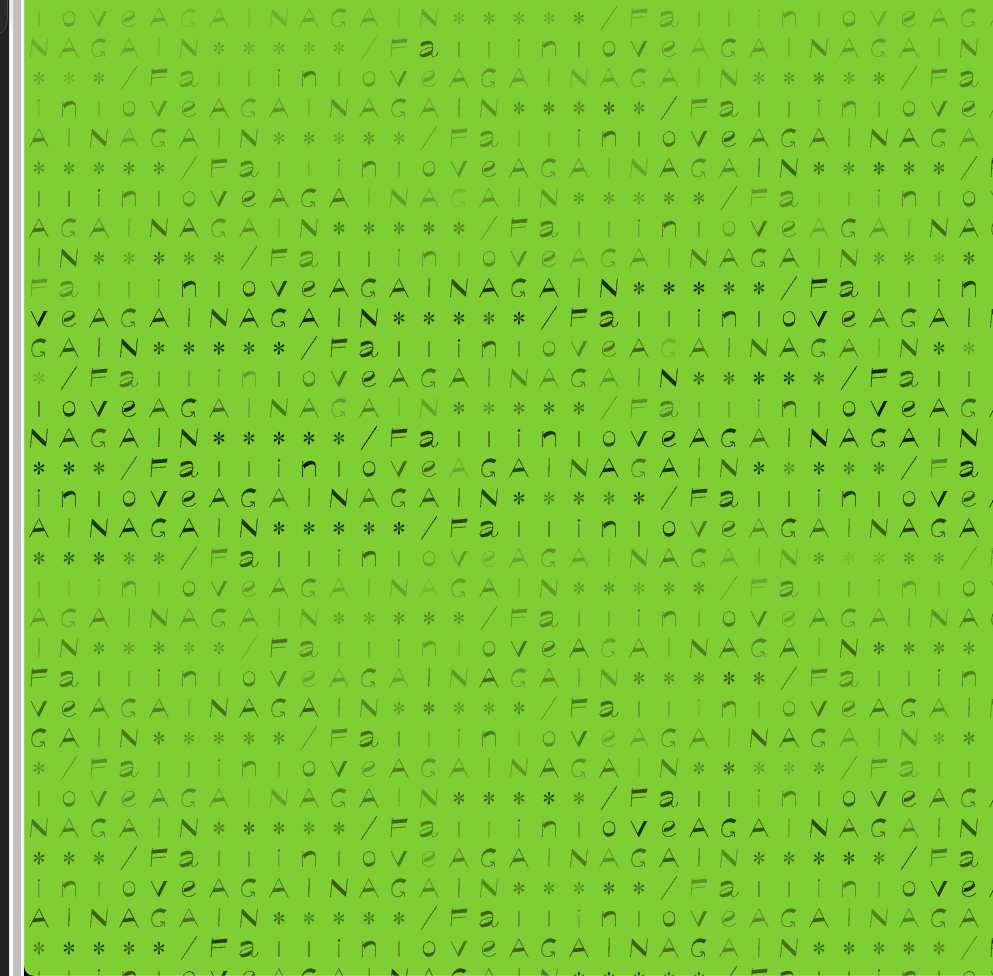

This week's assignment, I chose two songs, both from Charli XCX's newly released album "Brat", and I used the colors from it to complete my work.

In the first one, I wanted to use the energy to make the word "brat" change in size, and I also modified the background, making it mosaic. When the energy is lower than 3000, it will change and make the word rotate.

n the second one, I chose the song called "Everything is Romantic", and the lyrics keep saying "Fall in love again and again". I wanted to use the visualization to emphasize this in my sample.
